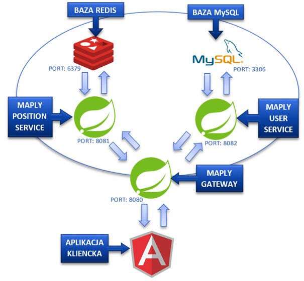

# Maply
This project demonstrates usage of reactive programming. Maply visualises position of group of users, on the map. User coordinates are updated in real-time.

## Description




## Services:

| Name                   | Port          | Description  |
| :-----------:          | :-----------: | :----:       |
| [maply-user-service](https://github.com/pioter-pioter/maply/tree/master/maply-user-service)         | 8082          | Uses MySQL database to store data about users.        |
| [maply-position-service](https://github.com/pioter-pioter/maply/tree/master/maply-position-service) | 8081          | Uses Redis Streams to stream position data. Streaming is done via Server-Sent Events and WebSocket.          |
| [maply-gateway](https://github.com/pioter-pioter/maply/tree/master/maply-gateway)                   | 8080          | API gateway. Forwards requests to proper services.          |


#### How to build and run?

 * Download/Clone the repository : 
   
   ```
   $ git clone https://github.com/pioter-pioter/maply.git --config core.autocrlf=false
   $ cd maply
   ```

 * To run the backend:

	  ```
	 $ docker-compose up
	  ```
 * To run the frontend:

	  ```
	 $ cd maply-frontend
	 $ npm install
	 $ ng serve
	  ```
 * Go to `http://localhost:4200` in your browser:
 * To run fake position data source:

	  ```
	 $ cd maply-mock-objects
	 $ mvnw.cmd spring-boot:run
	  ```